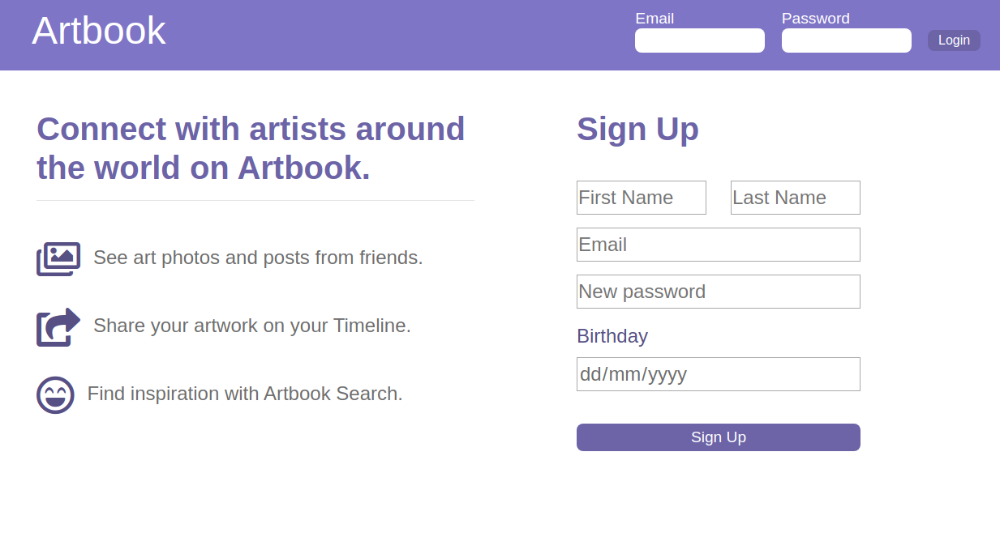
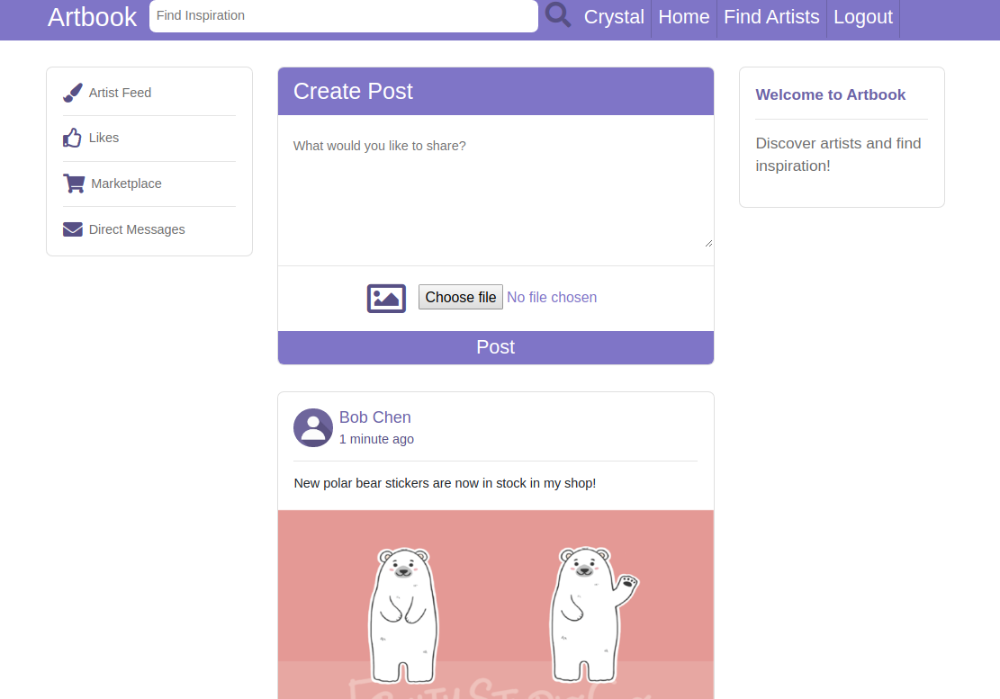
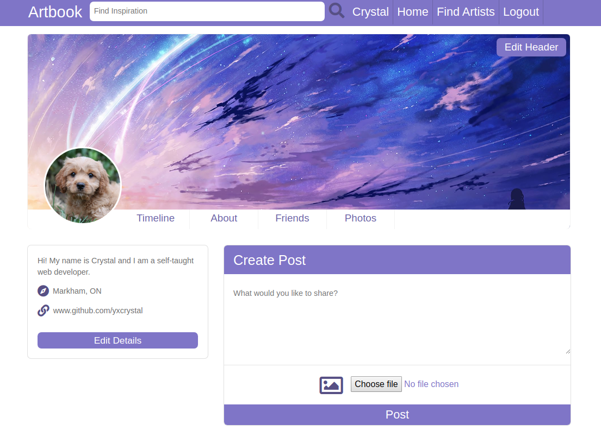
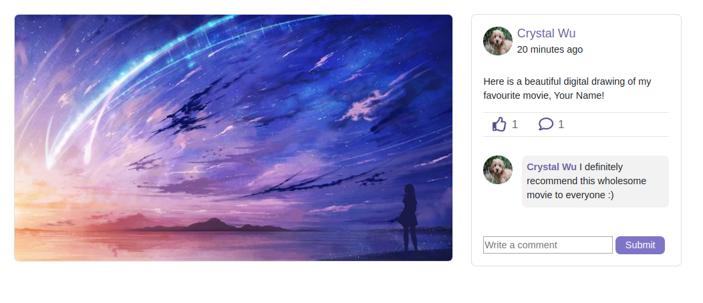
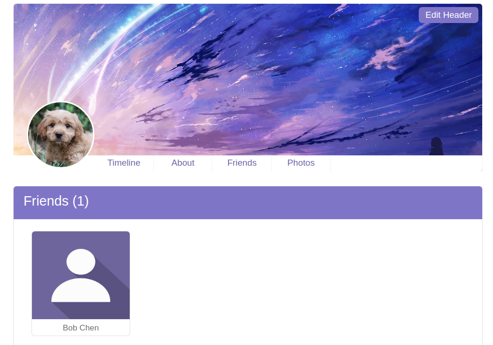
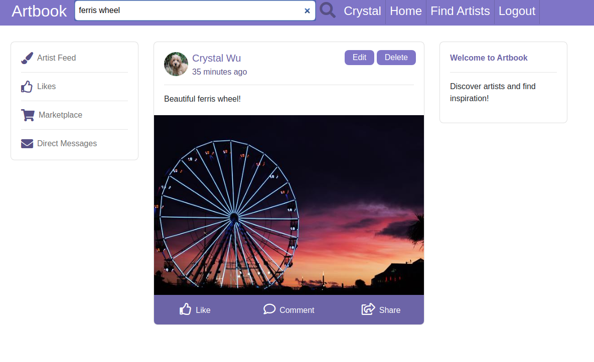

# README

Artbook is a social media app that is inspired by Facebook. Artbook is built using Ruby on Rails and follows the Odin project's [curriculum](https://www.theodinproject.com/lessons/final-project)

## User Features:

### Homepage

- User sign up and login page
- Uses Devise Ruby Gem for authentication and authorization

### Newsfeed

- Able to see posts on newsfeed from friends in order from newest to oldest

### User Profile

- Edit user profile including biography, profile picture and cover photo
- Images are uploaded using Paperclip Ruby Gem and is stored on AWS

### Posts

- Create text posts and optionally attach an image
- Able to edit or delete own posts
- Like and/or comment on posts

### Friends

- Able to add/delete users as friends
- Friends show up on user's profile page

### Search Bar

- Able to search for posts or other users
